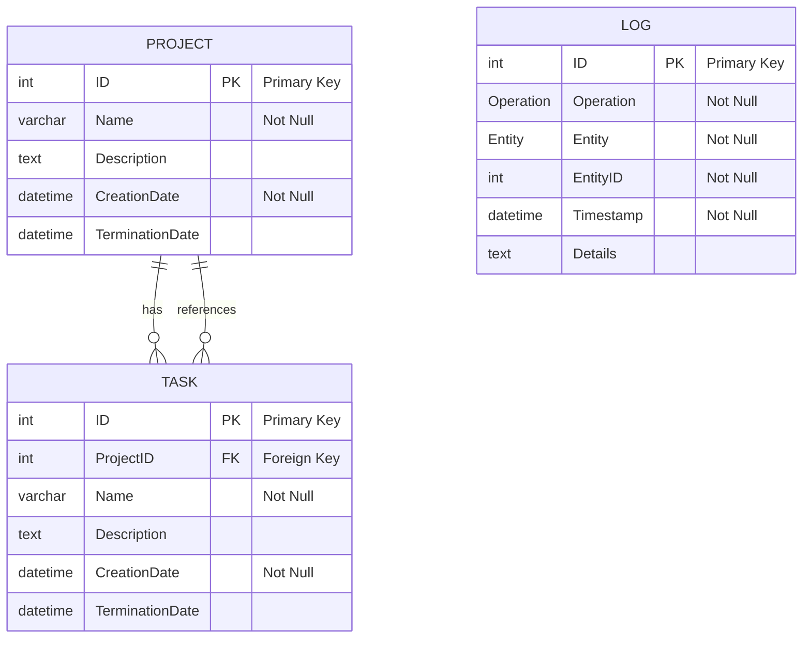

```mermaid
erDiagram
    PROJECT {
        int ID PK "Primary Key"
        varchar Name "Not Null"
        text Description
        datetime CreationDate "Not Null"
        datetime TerminationDate
    }
    
    TASK {
        int ID PK "Primary Key"
        int ProjectID FK "Foreign Key"
        varchar Name "Not Null"
        text Description
        datetime CreationDate "Not Null"
        datetime TerminationDate
    }
    
    LOG {
        int ID PK "Primary Key"
        Operation Operation "Not Null"
        Entity Entity "Not Null"
        int EntityID "Not Null"
        datetime Timestamp "Not Null"
        text Details
    }

    PROJECT ||--o{ TASK : has
    TASK }o--|| PROJECT : references
```
