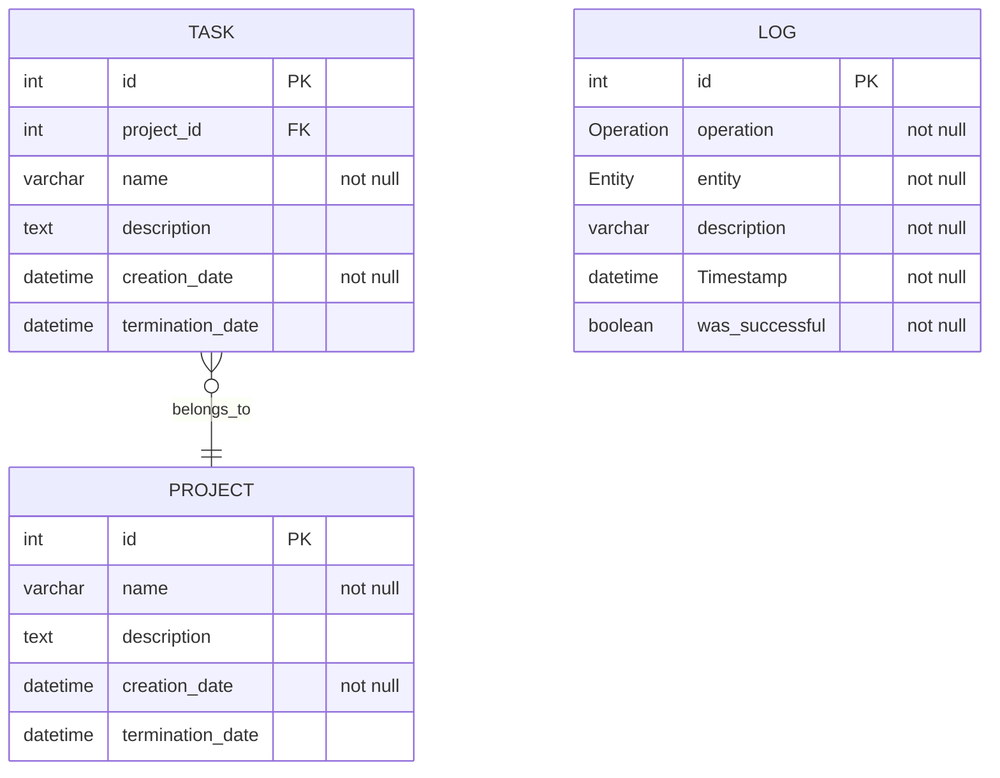

# Task and Project Management

## Members

- [Agudelo Hernández Carlos Andrés (2125653)](https://github.com/Carlosher007).

- [Calderón Prieto Brandon (2125973)](https://github.com/Br4z).

- [Ortiz Rodríguez Nicol Valeria (2241463)](https://github.com/JabColV).

## Description

This application is designed to facilitate the management of tasks and projects. It allows users to create, modify, delete, and retrieve projects and their associated tasks. All operations are logged for record-keeping purposes.

> You can find more information in this [file](./statement.pdf).

## Key features

- Project management: create and manage multiple projects, each with a unique description and lifecycle.

- Task management: assign and manage tasks within projects, each with specific details and deadlines.

- CRUD operations: full support for create, read, update, and delete operations on both projects and tasks.

- Database persistence: projects and tasks are stored in a relational database for persistent storage.

- Modular design: the application is designed with modular components to facilitate deployment in containers using Kubernetes.

## Model

## Usage information

To run the project in k8s run the `run.sh` script. The script will create the "backend" (a PostgreSQL database and a Spring application) and "frontend" deployments each with a replica. To use the application a "NodePort" has been created for the application ("frontend-service") in the port $80$.

> First you will have to give it execution permissions.

If you want to play only with the backend you can find information associated to the requests in this [file](./backend/requests.md).
