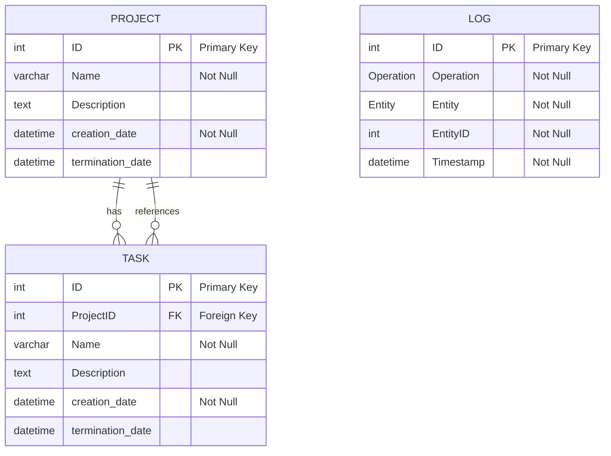

# Task and Project Management

## Description

This application is designed to facilitate the management of tasks and projects. It allows users to create, modify, delete, and retrieve projects and their associated tasks. All operations are logged for record-keeping purposes.

## Key Features

- **Project Management**: Create and manage multiple projects, each with a unique description and lifecycle.
- **Task Management**: Assign and manage tasks within projects, each with specific details and deadlines.
- **CRUD Operations**: Full support for Create, Read, Update, and Delete operations on both projects and tasks.
- **Database Persistence**: Projects and tasks are stored in a relational database for persistent storage.
- **Modular Design**: The application is designed with modular components to facilitate deployment in containers using Kubernetes.

## Diagrams

### Endpoints

### Project

The project module provides the following endpoints:

- **GET /projects**: Retrieve all projects.

  - This endpoints doesn't need any parameters.

  This endpoint returns a list of projects with the following fields:

  - _ID_: The unique identifier of the project.
  - _Name_: The name of the project.
  - _Description_: A brief description of the project.
  - _creation_date_: The date when the project was created.
  - _termination_date_: The date when the project is terminated.

  Also, this endpoint have to do and enpoint to logging the operation with the following fields:

  - _Operation_: `GET`
  - _Entity_: `Project`
  - _EntityID_: `All`

- **GET /projects/{id}**: Retrieve a specific project by ID.

  - This endpoint needs the _ID of the project_ to be retrieved.

  This endpoint returns a project with the following fields:

  - _ID_: The unique identifier of the project.
  - _Name_: The name of the project.
  - _Description_: A brief description of the project.
  - _creation_date_: The date when the project was created.
  - _termination_date_: The date when the project is terminated.

  Also, this endpoint have to do and enpoint to logging the operation with the following fields:

  - _Operation_: `GET`
  - _Entity_: `Project`
  - _EntityID_: `ID`

- **POST /new-project**: Create a new project.

  - This endopints needs the following parameters:
    - _Name_: The name of the project.
    - _Description_: A brief description of the project.

  This endpoint returns the created project with the following fields:

  - _ID_: The unique identifier of the project.
  - _Name_: The name of the project.
  - _Description_: A brief description of the project.
  - _termination_date?_: The date when the project is terminated.

  Also, this endpoint have to do and enpoint to logging the operation with the following fields:

- **PUT /update-project/{id}**: Update an existing project by ID.

  - This endpoint needs the _ID of the project_ to be updated.
  - This endpoint needs the following parameters:
    - _Name_: The name of the project.
    - _Description_: A brief description of the project.
    - _termination_date?_: The date when the project is terminated.

  This endpoint returns the updated project with the following fields:

  - _ID_: The unique identifier of the project.
  - _Name_: The name of the project.
  - _Description_: A brief description of the project.
  - _creation_date_: The date when the project was created.
  - _termination_date_: The date when the project is terminated.

  Also, this endpoint have to do and enpoint to logging the operation with the following fields:

  - _Operation_: `PUT`
  - _Entity_: `Project`
  - _EntityID_: `ID`

- **DELETE /delete-project/{id}**: Delete a project by ID.

  - This endpoint needs the _ID of the project_ to be deleted.

  This endpoint doen't return any value.

  Also, this endpoint have to do and enpoint to logging the operation with the following fields:

  - _Operation_: `DELETE`
  - _Entity_: `Project`
  - _EntityID_: `ID`

### Task

The task module provides the following endpoints:

- **GET /tasks/{id_project}**: Retrieve all tasks of a specific project.

  - This endpoint needs the _ID of the project_ to be retrieved.

  This endpoint returns a list of tasks with the following fields:

  - _ID_: The unique identifier of the task.
  - _ProjectID_: The ID of the project to which the task belongs.
  - _Name_: The name of the task.
  - _Description_: A brief description of the task.
  - _creation_date_: The date when the task was created.
  - _termination_date_: The date when the task is terminated.

  Also, this endpoint have to do and enpoint to logging the operation with the following fields:

  - _Operation_: `GET`
  - _Entity_: `Task`
  - _EntityID_: `ProjectID`

- **GET /tasks/{id}**: Retrieve a specific task by ID.

  - This endpoint needs the _ID of the task_ to be retrieved.

  This endpoint returns a task with the following fields:

  - _ID_: The unique identifier of the task.
  - _ProjectID_: The ID of the project to which the task belongs.
  - _Name_: The name of the task.
  - _Description_: A brief description of the task.
  - _creation_date_: The date when the task was created.
  - _termination_date_: The date when the task is terminated.

  Also, this endpoint have to do and enpoint to logging the operation with the following fields:

  - _Operation_: `GET`
  - _Entity_: `Task`
  - _EntityID_: `ID`

- **POST /new-task/{id_project}**: Create a new task.

  - This endpoint needs the _ID of the project_ to which the task belongs.
  - This endpoint needs the following parameters:
    - _Name_: The name of the task.
    - _Description_: A brief description of the task.
    - _termination_date?_: The date when the task is terminated.

  This endpoint returns the created task with the following fields:

  - _ID_: The unique identifier of the task.
  - _ProjectID_: The ID of the project to which the task belongs.
  - _Name_: The name of the task.
  - _Description_: A brief description of the task.
  - _creation_date_: The date when the task was created.
  - _termination_date_: The date when the task is terminated.

  Also, this endpoint have to do and enpoint to logging the operation with the following fields:

  - _Operation_: `POST`
  - _Entity_: `Task`
  - _EntityID_: `ID`

- **PUT /update-task/{id}**: Update an existing task by ID.

  - This endpoint needs the _ID of the task_ to be updated.
  - This endpoint needs the following parameters:
    - _ProjectID_: The ID of the project to which the task belongs.
    - _Name_: The name of the task.
    - _Description_: A brief description of the task.

  This endpoint returns the updated task with the following fields:

  - _ID_: The unique identifier of the task.
  - _ProjectID_: The ID of the project to which the task belongs.
  - _Name_: The name of the task.
  - _Description_: A brief description of the task.
  - _creation_date_: The date when the task was created.
  - _termination_date_: The date when the task is terminated.

  Also, this endpoint have to do and enpoint to logging the operation with the following fields:

  - _Operation_: `PUT`
  - _Entity_: `Task`
  - _EntityID_: `ID`

- **DELETE /delete-task/{id}**: Delete a task by ID.

  - This endpoint needs the _ID of the task_ to be deleted.

  This endpoint doen't return any value.

  Also, this endpoint have to do and enpoint to logging the operation with the following fields:

  - _Operation_: `DELETE`
  - _Entity_: `Task`
  - _EntityID_: `ID`

### Logging

The logging module provides the following endpoints:

- **GET /logs**: Retrieve all logs.

  - This endpoints doesn't need any parameters.

  This endpoint returns a list of logs with the following fields:

  - _ID_: The unique identifier of the log.
  - _Operation_: The operation performed.
  - _Entity_: The entity affected by the operation.
  - _EntityID_: The ID of the entity affected by the operation.
  - _Timestamp_: The date and time when the operation was performed.

- **POST /new-log**: Create a new log.

  - This endopints needs the following parameters:
    - _Operation_: The operation performed.
    - _Entity_: The entity affected by the operation.
    - _EntityID_: The ID of the entity affected by the operation.

  This endpoint returns the created log with the following fields:

  - _ID_: The unique identifier of the log.
  - _Operation_: The operation performed.
  - _Entity_: The entity affected by the operation.
  - _EntityID_: The ID of the entity affected by the operation.
  - _Timestamp_: The date and time when the operation was performed.
